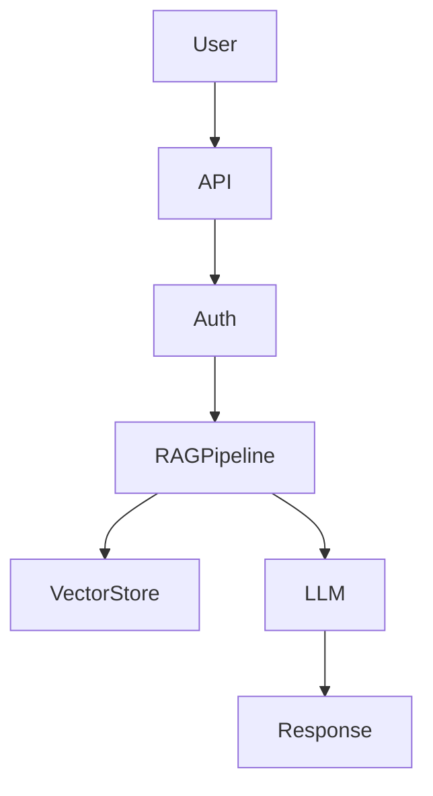

# Overview

**INDEXIA** is a modular and secure Retrieval-Augmented Generation (RAG) framework designed for enterprise document search.

It allows organizations to:

-  Search structured internal documentation
-  Connect any Large Language Model (LLM)
-  Enforce role-based access control (RBAC)
-  Switch between multiple RAG strategies
-  Operate in secure and sensitive environments

#  Project Objectives

The project addresses three major research and engineering challenges:

### 1. LLM Comparative Study
Criteria:
- Reasoning performance
- Context window size
- Latency
- API cost
- Enterprise integration feasibility

### 2️. RAG Variants Implementation

### 3️. Secure Enterprise Architecture

The system guarantees:

- Document isolation
- Access control enforcement
- Prevention of data leakage
- Modular LLM-RAG abstraction
- Enterprise-ready deployment

# 🏗️ System Architecture

##  High-Level Flow

# Technical Architecture

## Indexing Layer

- Document chunking
- Embedding generation
- FAISS vector storage
- Metadata indexing

---

##  RAG Pipeline

1. User authentication
2. Authorization filtering
3. Semantic search (Top-k)
4. Context injection
5. LLM generation
6. Secure post-processing
